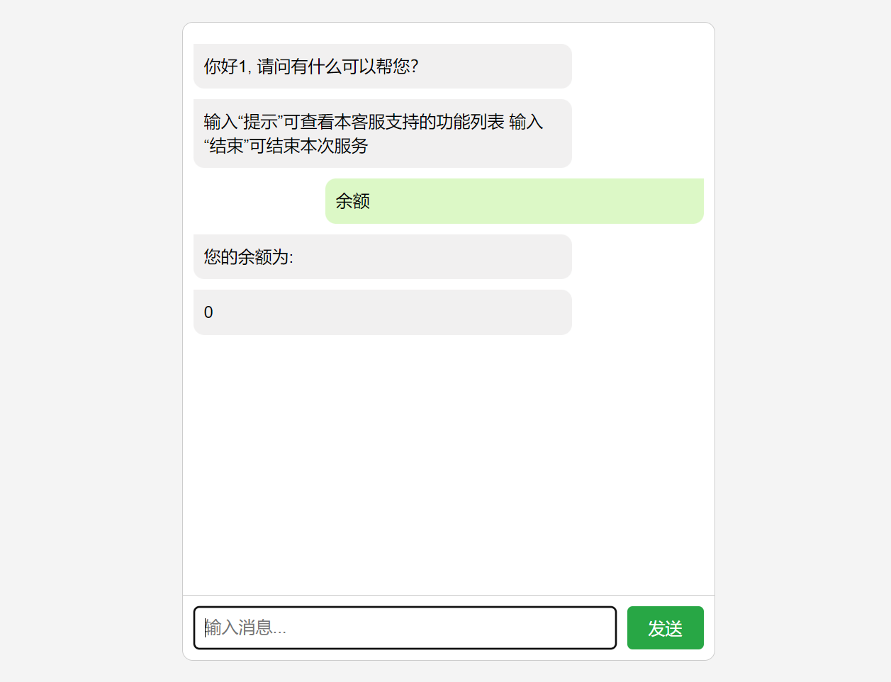
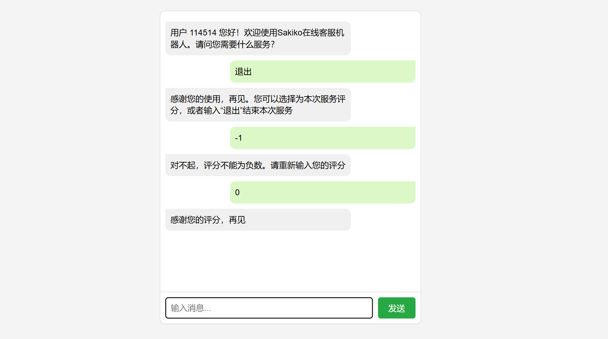
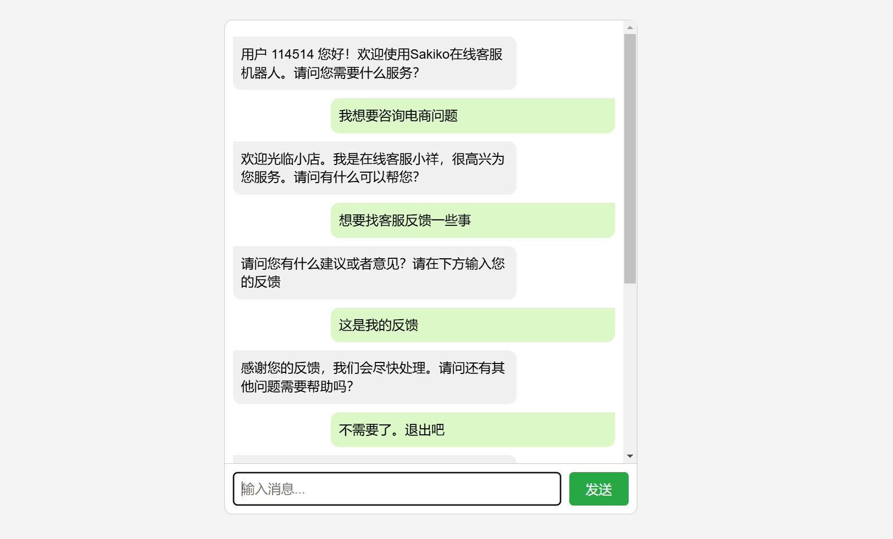

# SakikoDSL
A Domain Specific Language and its interpreter for customer service robots  
一个应用于客服机器人的领域特定语言（DSL）及其解释器  
程序设计实践 作业  

## 项目介绍
大家好，这里是客服S 不是丰川祥子  
本项目定义了一个领域特定脚本语言，这个语言能够描述在线客服机器人的自动应答逻辑，并设计实现了一个解释器解释执行这个脚本，可以根据用户的不同输入，根据脚本的逻辑设计给出相应的应答。  
&emsp;  
本项目使用前端技术支持图形化用户界面：  
  
用户登录与注册  

客服对话界面  

本语法支持条件判断等功能

本客服机器人支持一定程度的模糊匹配，可以更好的理解用户的输入

## DSL语法描述
对于`SakikoDSL`语言，我们定义了如下的语法规则：  
对于整型常量，我们使用正则表达式`^[0-9]+$`进行匹配  
对于浮点型常量，我们使用正则表达式`^[0-9]+\.[0-9]+$`进行匹配  
对于字符串常量，我们使用正则表达式`^".*"$`进行匹配  
对于标识符，我们使用正则表达式`^[a-zA-Z_][a-zA-Z0-9_]*$`进行匹配  
其中，语言的每一行是一个基本语句。一个基本语句有且仅能是以下几种形式之一：  
1. 以`//`开头的注释行，表示整行内容为注释。例如，`// This is a comment`
2. 以关键字`string`、`float`、`int`或`var`开头，后根一个标识符的变量声明语句。例如，`var a, b`
3. 以关键字`input`开头，后跟一个标识符的输入语句，表示从用户输入中读取一个字符串并赋值给变量。例如，`input a`
4. 以关键字`print`开头，后跟多个以`,`分割的字符串常量或变量的输出语句，表示按序连续输出这些变量或字符串。例如，`print "Hello, world", a`
5. 以关键字`Timeout`开头，后跟一个整型常量的超时语句，表示等待指定的时间。例如，`Timeout 1000`
6. 以关键字`Exit`开头，后跟一个整型常量的退出语句，表示退出整个脚本，返回指定的状态码。例如，`Exit 0`
7. 以关键字`call`开头，后跟一个标识符以及括号内的参数列表的函数调用语句。参数调用列表以`,`分割，可以为空。例如，`call func(a, 2, 3.0)`
8. 以关键字`def`开头，后跟一个标识符以及括号内的参数列表的函数定义语句。表示某函数的定义。例如，`def func(a, b, c):`
9. 以关键字`endFunc`开头，表示某个函数定义的结束。后面可以跟一个变量或常量，表示函数的返回值。例如，`endFunc 0`
10. 标识符 + `=` + 表达式，表示变量的赋值语句。其中表达式定义为以`+` `-` `*` `/`连接常量、变量、括号或表达式的形式。例如，`a = b + 1`
11. 以关键字`if`开头，后跟一个表达式的条件语句。其中表达式定义为以`==` `!=` `>` `<` `>=` `<=`连接常量、变量、括号或表达式的形式。例如，`if a == 1:`
12. 关键字`endIf`，表示某一个条件判断语句的结束
13. 以关键字`switch`开头，后跟一个变量，表示一个多分支判断语句，匹配对应的`case`语句。例如，`switch a:`
14. 以关键字`case`开头，后跟一个常量，表示一个分支的匹配语句。例如，`case 1:`
15. 关键字`default`，表示一个默认分支的匹配语句
16. 关键字`endSwitch`，表示多分支判断语句的结束
17. 以关键字`goto`开头，后跟一个标识符，表示跳转到某个标签的语句。例如，`goto label`
18. 以关键字`To`开头，后跟一个标识符，表示一个标签的定义语句。例如，`To label`
19. 以关键字`input`开头，后跟一个标识符，关键字`Timeout`和一个整型常量，以及一个函数名称。表示等待用户输入，超时时间为指定的整型常量，超时后调用指定的函数。例如，`input a Timeout 1000 func()`

同时，该DSL解释器还支持一些特殊的语句规则，便于该特定领域的使用：
1. 以关键字`ifLike`开头，后跟括号内的两个参数，第一个参数为字符变量，第二个参数为字符常量，表示字符串的模糊匹配。将其视作一个`if`判断语句。例如，`ifLike(a, "b"):`
2. 关键字`__login__`，表示执行一系列用户登录操作。将其视作一个特殊的函数调用语句