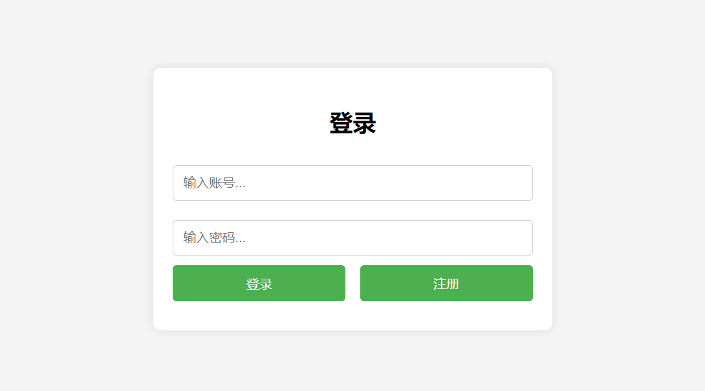

# SakikoDSL
A Domain Specific Language and its interpreter for customer service robots  
一个应用于客服机器人的领域特定语言（DSL）及其解释器  
程序设计实践 作业  

## 项目介绍
大家好，这里是客服S 不是丰川祥子  
本项目定义了一个领域特定脚本语言，这个语言能够描述在线客服机器人的自动应答逻辑，并设计实现了一个解释器解释执行这个脚本，可以根据用户的不同输入，根据脚本的逻辑设计给出相应的应答。  
&emsp;  
本项目使用前端技术支持图形化用户界面：  
  
用户登录与注册  

客服对话界面  

